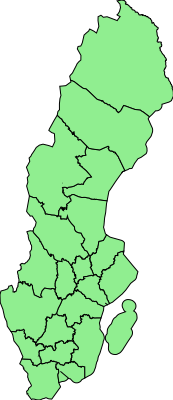

Guile Shapefile
===============

Guile Shapefile is a Guile library for reading
[shapefiles](https://en.wikipedia.org/wiki/Shapefile).

Examples
--------

	env GUILE_LOAD_PATH=. examples/to-svg.scm \
		--file riks/an_riks \
		--height 300

*Hover to show names doesn't work for inline image, click image to get
interaction*

Documentation
-------------

Full documentation can be found in the [info file](guile-shapefile.texi), or
[rendered as html](//hugonikanor.github.io/guile-shapefile/).

Contributing
------------

[//hugonikanor.github.io/guile-shapefile/Contributing-and-To_002dDo.html#Contributing-and-To_002dDo](See documentation for information about contributing)

